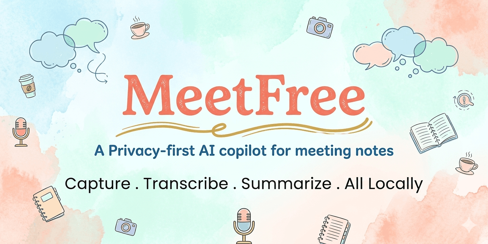

# MeetFree

MeetFree is a local-first desktop app for meeting capture, transcription, search, summaries, and export.

The product of record in this repository is the native Tauri desktop application in `desktop/`.

## Current Status

- App manifests are currently versioned `0.5.0`.
- `v0.4.0` scope is complete in the codebase: structured meeting intelligence, reusable speaker identities, review workflows, and structured export assembly are implemented.
- `v0.5.0` is in progress: context ingestion, provider-capability queries, and embedding retrieval foundation have landed, while adaptive extraction, calendar enrichment, and later meeting-memory features remain unfinished.

## Verified Shipped Capabilities

- Desktop UI built with Tauri 2, Next.js 16, React 18, and Rust
- Microphone recording, import, retranscription, and recap-first meeting details flow
- Local transcription via Whisper and Parakeet
- SQLite FTS5 transcript search with BM25 ranking plus date, source, summary, and backend tag filters
- Markdown, PDF, and DOCX export, including structured action items and decisions when present
- Speaker diarization plus reusable speaker identities, manual voice profiles, and structured review workflows
- Summary generation through Ollama, OpenAI, Claude, Groq, OpenRouter, and custom OpenAI-compatible endpoints
- Vocabulary rules applied across transcript, summary, and export flows
- Meeting details `Context` tab with scratchpad editing, picker-backed text attachment drafts, context-item management, and meeting tag assignment
- Meetings list tag filter plus Settings tag-management section
- Auto-updater, onboarding, notifications, and OS-backed secure credential storage

## v0.5 Foundation Landed In Repo

- Baseline schema now includes meeting context assets, tags, meeting-tag links, embeddings, and decision-to-action-item relationship storage
- Tauri commands and Rust repositories exist for scratchpad, attachments, notes/calendar assets, tags, and assembled meeting context packages
- Summary generation now loads meeting context and merges scratchpad, tags, and text attachment content into the prompt when present
- Export assembly includes scratchpad and tags in Markdown, PDF, and DOCX output
- Embedding storage tables, SQLite similarity helpers, and Ollama/OpenAI-compatible embedding provider abstractions are implemented
- Provider capability registry groundwork exists in Rust with per-provider defaults and unit tests
- Capability-query Tauri commands now expose provider feature metadata to the frontend layer
- Background embedding reindexing now runs after transcript saves, retranscription/import completion, and context/tag updates for supported providers
- Frontend `contextService` plus hooks for context assets, scratchpad, tags, preferences, and extracted summary polling now exist
- The merge gate is configured to run frontend build/lint/test plus Rust `fmt`, `clippy`, `check`, and `test`

## Still In Progress

- Summary extraction still uses the existing markdown and evidence-driven path rather than provider-native tool use or JSON mode
- There is not yet a dedicated semantic-search UI or separate embedding-settings surface; retrieval is currently command-level infrastructure plus background indexing
- Attachment handling now supports native file picking plus text-preview ingestion for common text formats; richer binary ingestion remains future work
- Calendar enrichment, cross-meeting meeting memory, and live copilot workflows remain future work

## Quick Start

### Prerequisites

- Node.js 20+
- pnpm 8+
- Rust 1.80+
- Platform-specific build tools, as described in [CONTRIBUTING.md](CONTRIBUTING.md)

### Windows CUDA Note

When running the desktop app with NVIDIA CUDA on Windows, `whisper-rs` needs MSVC's conforming preprocessor enabled.

- `cmd.exe`: `set CL=/Zc:preprocessor`
- PowerShell: `$env:CL="/Zc:preprocessor"`

Set that in the same shell before `pnpm --dir desktop run tauri:dev:cuda` or `pnpm --dir desktop run tauri:build:cuda`.
The helper scripts in [`desktop/`](desktop/) set this automatically.

### Run Locally

```bash
pnpm --dir desktop install
pnpm --dir desktop tauri:dev
```

### Release Checks

```bash
pwsh -File scripts/release-smoke.ps1
# macOS/Linux equivalent:
bash scripts/release-smoke.sh
```

## Code Map

- Frontend: `desktop/src/`
- Native backend: `desktop/src-tauri/src/`
- Database migrations: `desktop/src-tauri/migrations/`
- Audio and transcription pipeline: `desktop/src-tauri/src/audio/`
- Summary engine: `desktop/src-tauri/src/summary/`
- Export pipeline: `desktop/src-tauri/src/export/`
- Diarization: `desktop/src-tauri/src/diarization/`
- Context assembly: `desktop/src-tauri/src/context/`
- Embedding foundation: `desktop/src-tauri/src/embeddings/`

For the current product workflow and repository guidance, see [AGENTS.md](AGENTS.md).
For the database schema and content model, see [docs/DATA_MODEL.md](docs/DATA_MODEL.md).
For manual desktop smoke checks, see [docs/QA_MATRIX.md](docs/QA_MATRIX.md).

## Privacy

- Recording, transcription, and storage run locally by default
- Cloud providers are optional and user-configured
- Provider API keys are stored in OS-backed secure storage
- Local summary options are available through Ollama
- Analytics is disabled in the current build; the shim is a no-op and does not send data

See [PRIVACY_POLICY.md](PRIVACY_POLICY.md) for complete privacy details.
